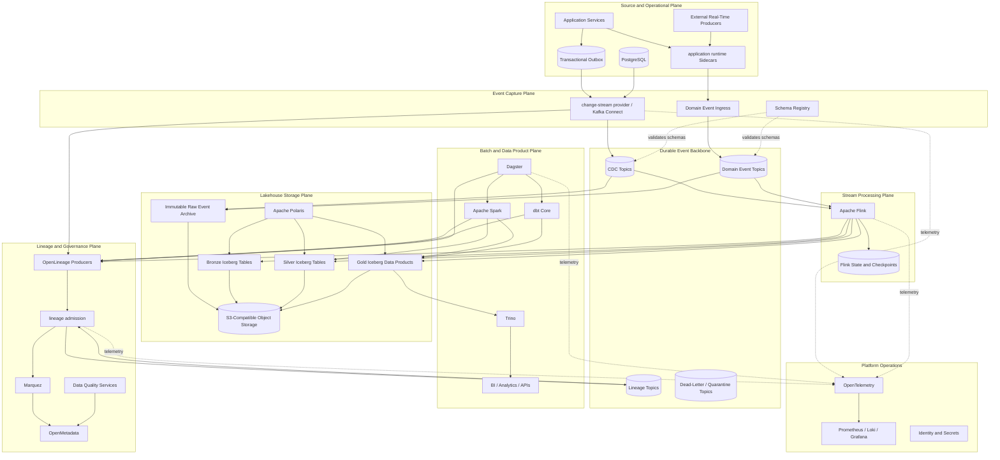

```mermaid
flowchart TB
    subgraph Sources["Source and Operational Plane"]
        PG[(PostgreSQL)]
        APP[Application Services]
        EXT[External Real-Time Producers]
        OUTBOX[(Transactional Outbox)]
        DAPR[application runtime Sidecars]
    end

    subgraph Capture["Event Capture Plane"]
        DBZ[change-stream provider / Kafka Connect]
        INGRESS[Domain Event Ingress]
        REG[Schema Registry]
    end

    subgraph Backbone["Durable Event Backbone"]
        CDC[(CDC Topics)]
        DOMAIN[(Domain Event Topics)]
        LINEAGE[(Lineage Topics)]
        DLQ[(Dead-Letter / Quarantine Topics)]
    end

    subgraph Streaming["Stream Processing Plane"]
        FLINK[Apache Flink]
        STATE[(Flink State and Checkpoints)]
    end

    subgraph Lakehouse["Lakehouse Storage Plane"]
        RAW[Immutable Raw Event Archive]
        BRONZE[Bronze Iceberg Tables]
        SILVER[Silver Iceberg Tables]
        GOLD[Gold Iceberg Data Products]
        OBJ[(S3-Compatible Object Storage)]
        CATALOG[Apache Polaris]
    end

    subgraph Batch["Batch and Data Product Plane"]
        SPARK[Apache Spark]
        DBT[dbt Core]
        DAGSTER[Dagster]
        TRINO[Trino]
        BI[BI / Analytics / APIs]
    end

    subgraph Lineage["Lineage and Governance Plane"]
        OL[OpenLineage Producers]
        EF[lineage admission]
        MARQUEZ[Marquez]
        OM[OpenMetadata]
        DQ[Data Quality Services]
    end

    subgraph Operations["Platform Operations"]
        OTEL[OpenTelemetry]
        OBS[Prometheus / Loki / Grafana]
        IAM[Identity and Secrets]
    end

    APP --> OUTBOX
    APP --> DAPR
    EXT --> DAPR
    OUTBOX --> DBZ
    PG --> DBZ
    DAPR --> INGRESS

    DBZ --> CDC
    INGRESS --> DOMAIN
    REG -. validates schemas .-> CDC
    REG -. validates schemas .-> DOMAIN

    CDC --> FLINK
    DOMAIN --> FLINK
    CDC --> RAW
    DOMAIN --> RAW

    FLINK --> STATE
    FLINK --> BRONZE
    FLINK --> SILVER
    FLINK --> GOLD

    RAW --> OBJ
    BRONZE --> OBJ
    SILVER --> OBJ
    GOLD --> OBJ
    CATALOG --> BRONZE
    CATALOG --> SILVER
    CATALOG --> GOLD

    DAGSTER --> SPARK
    DAGSTER --> DBT
    SPARK --> SILVER
    SPARK --> GOLD
    DBT --> GOLD
    GOLD --> TRINO
    TRINO --> BI

    DBZ --> OL
    FLINK --> OL
    SPARK --> OL
    DBT --> OL
    DAGSTER --> OL
    OL --> EF
    EF --> LINEAGE
    LINEAGE --> EF
    EF --> MARQUEZ
    MARQUEZ --> OM
    DQ --> OM

    DBZ -. telemetry .-> OTEL
    FLINK -. telemetry .-> OTEL
    DAGSTER -. telemetry .-> OTEL
    EF -. telemetry .-> OTEL
    OTEL --> OBS
```
