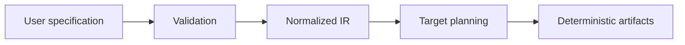

# Architecture Overview

`platformctl` is a compiler, not a runtime controller.

Core compiler packages do not import Kubernetes, Docker, broker, Schema Registry, cloud SDK, or template-engine clients. Target-specific behavior belongs in adapters.

Current release adds resource graph resolution before target planning. The Compose adapter projects only graph-required capabilities into:

- `compose.yaml`;
- adapter-owned configuration;
- schema registry bootstrap data;
- verification and recovery artifacts;
- resource inventory and provenance.

The core plan remains technology-neutral: ownership, lifecycle, bindings, external resources, policies, overrides, logical streams, contracts, archives, sources, lineage, audit, verification, and recovery are resolved before Compose service names are introduced.
