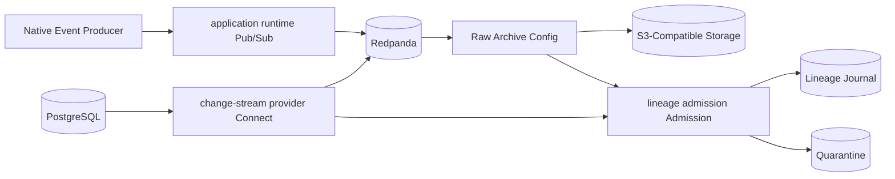

# Runtime Architecture

The local runtime is derived from the graph. A governed reference architecture can include CDC, native events, raw archive, and lineage admission:

Each edge in that diagram is optional unless declared by a binding or required by policy. `RelationalSource` alone does not render change-stream provider or a broker, external streams do not render managed brokers, and lineage admission appears only when lineage selects it.

Compose supports local development and hardened single-host production. It does not claim distributed production HA. Kubernetes, Flink, Iceberg, Dagster, Trino, and OpenMetadata are scheduled for later planned releases.
