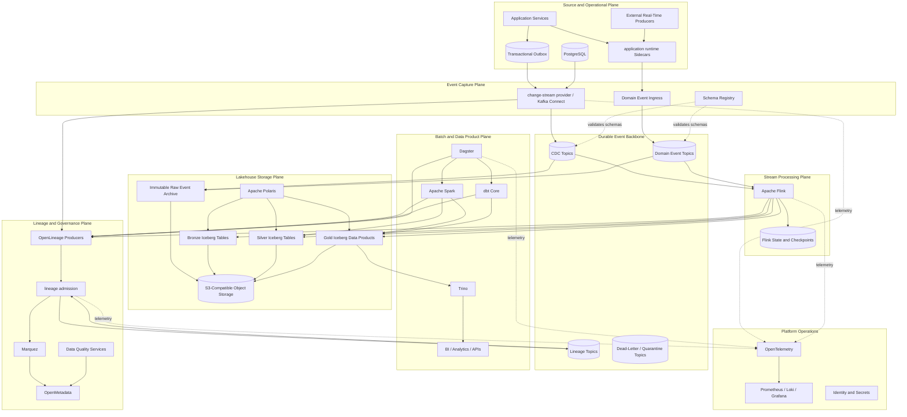
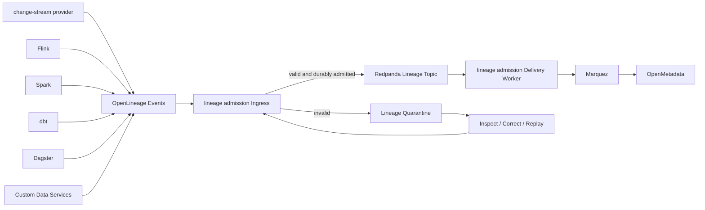

# Mature Event-First Data Platform Design

The mature target should use a **single durable event backbone** for both initial ingestion cases:

1. PostgreSQL operational data captured through Change Data Capture (CDC).
2. Native real-time domain events emitted by applications or external services.

Both enter the lakehouse as immutable events, but they retain different semantics:

* **CDC events** describe committed row-level state changes.
* **Domain events** describe business facts or decisions.
* **Lineage events** describe how data-processing jobs, runs, and datasets relate.

These event classes may share infrastructure, but they should use separate topics, contracts, access policies, retention rules, and processing paths.

This design advances directly toward the Ministry’s intended target state: organization-wide reporting, real-time operational capabilities, governance, reusable data assets, and eventual machine-learning support.  It also preserves the architecture principles already established: domain systems remain authoritative, data lands in independent storage, and compute technologies can evolve without rewriting historical data. 

---

## 1. Recommended production stack

| Capability                        | Selected system                                           | Responsibility                                                                                  |
| --------------------------------- | --------------------------------------------------------- | ----------------------------------------------------------------------------------------------- |
| Operational source                | PostgreSQL                                                | Authoritative transactional source                                                              |
| CDC                               | change-stream provider PostgreSQL Connector on Kafka Connect            | PostgreSQL logical replication to ordered change events                                         |
| Real-time application integration | application runtime Pub/Sub                                              | Stable application API for publishing and consuming domain events                               |
| Reliable domain event publication | Transactional outbox + change-stream provider                           | Atomically commit application state and its corresponding domain event                          |
| Event backbone                    | Redpanda                                                  | Durable, partitioned, replayable event storage                                                  |
| Event contracts                   | Redpanda Schema Registry                                  | Avro, Protobuf, or JSON Schema versioning and compatibility                                     |
| Event envelope                    | CloudEvents                                               | Common metadata envelope for native domain and lineage events                                   |
| Stream processing                 | Apache Flink                                              | Stateful event processing, deduplication, ordering, joins, event-time logic, and Iceberg writes |
| Object storage                    | S3-compatible object storage                              | Durable raw objects, Iceberg data files, checkpoints, archives, and quarantines                 |
| Table format                      | Apache Iceberg v2                                         | ACID tables, snapshots, schema evolution, partition evolution, and time travel                  |
| Iceberg catalog                   | Apache Polaris                                            | Central Iceberg REST catalogue and multi-engine access control                                  |
| Batch and heavy transformation    | Apache Spark                                              | Large backfills, historical recomputation, complex transformations, and maintenance             |
| Analytical transformation         | dbt Core                                                  | Versioned Silver-to-Gold SQL models, tests, documentation, and metric logic                     |
| Interactive query                 | Trino                                                     | SQL query federation and governed access to Iceberg                                             |
| Data orchestration                | Dagster                                                   | Asset orchestration, dependencies, partitions, backfills, retries, schedules, and checks        |
| Lineage specification             | OpenLineage                                               | Standard representation of jobs, runs, datasets, facets, and parent-child execution             |
| Lineage gateway                   | lineage admission                                                 | Validation, durable admission, quarantine, delivery tracking, retry, and replay                 |
| Lineage backend                   | Marquez                                                   | Operational OpenLineage persistence and visualization                                           |
| Enterprise metadata               | OpenMetadata                                              | Catalogue, ownership, glossary, classifications, quality, lineage, and discovery                |
| Data quality                      | Soda Core or Great Expectations plus Dagster asset checks | Technical and business data-quality validation                                                  |
| Observability                     | OpenTelemetry, Prometheus, Loki, Grafana                  | Metrics, logs, traces, alerts, and operational dashboards                                       |
| Identity                          | OIDC provider plus workload identity                      | Human and machine authentication                                                                |
| Secrets                           | Vault or approved secrets manager                         | Credentials, certificates, and rotation                                                         |
| Runtime                           | Kubernetes                                                | Scheduling, scaling, fault recovery, configuration, and workload isolation                      |
| Infrastructure provisioning       | OpenTofu/Terraform, Helm, GitOps                          | Reproducible environment and application deployment                                             |
| CI/CD                             | GitHub Actions or equivalent                              | Test, scan, validate, package, and deploy                                                       |

### Why Flink is the primary stream processor

Flink should own continuous event-to-Iceberg processing because the platform’s core workload is event-first and requires:

* persistent state;
* event-time processing;
* checkpoints;
* ordered handling within keys;
* stream joins;
* CDC changelog interpretation;
* bounded and unbounded execution;
* transactional table commits.

The Apache Iceberg Flink sink supports batch and streaming writes and documents exactly-once sink semantics when checkpointing is configured. ([Apache Iceberg][1])

Spark remains important, but mainly for:

* historical backfills;
* bulk recomputation;
* large analytical transformations;
* Iceberg maintenance;
* data-science workloads.

---

# 2. Logical system architecture



---

# 3. Input path A: PostgreSQL CDC

## 3.1 Capture

PostgreSQL logical replication exposes committed changes from the transaction log. change-stream provider converts those changes into structured records containing:

* database, schema, and table identity;
* operation type;
* before and after values;
* source transaction metadata;
* transaction log position;
* source timestamp;
* connector ingestion timestamp;
* snapshot state;
* schema metadata.

The change-stream provider PostgreSQL connector is designed specifically to capture row-level PostgreSQL changes. ([change-stream provider][2])

Recommended topic pattern:

```text
cdc.<environment>.<domain>.<database>.<schema>.<table>.v1
```

Example:

```text
cdc.prod.education.sms.public.student_attendance.v1
```

## 3.2 Transactional outbox

CDC of normal business tables tells downstream systems **what rows changed**, but not necessarily **why**.

Where an application needs to publish a meaningful domain event, it should write both:

1. the operational state change; and
2. an outbox event

within the same PostgreSQL transaction.

change-stream provider then publishes the outbox record as the domain event. The transactional outbox avoids an inconsistent state where the database commit succeeds but message publication fails, or the event is published when the database transaction did not commit. ([change-stream provider][3])

Example:

```sql
BEGIN;

UPDATE student_attendance
SET status = 'PRESENT',
    updated_at = now()
WHERE attendance_id = '...';

INSERT INTO outbox_event (
    event_id,
    aggregate_type,
    aggregate_id,
    event_type,
    payload,
    occurred_at
)
VALUES (
    '019...',
    'student-attendance',
    '...',
    'attendance.corrected.v1',
    '{...}',
    now()
);

COMMIT;
```

This produces two valid data representations:

* a CDC stream from `student_attendance`;
* a domain event from `outbox_event`.

They should not be collapsed into the same topic.

---

# 4. Input path B: native real-time events

Applications and approved external producers publish native domain events through application runtime Pub/Sub.

```text
Application
    → application runtime Pub/Sub API
    → Redpanda
    → Domain event topic
```

application runtime provides a consistent HTTP or gRPC application interface while the underlying broker remains Redpanda. It is appropriate here because it reduces broker-specific code across Ministry applications and can add service invocation, secrets, workload identity, resiliency, and dead-letter handling around application interactions.

application runtime Pub/Sub delivery remains retry-oriented rather than magically exactly once. A subscriber acknowledges successful processing through its response, and unsuccessful processing may be retried. ([application runtime Docs][4]) Consumers must therefore remain idempotent.

Recommended topic pattern:

```text
event.<environment>.<domain>.<aggregate>.<event-name>.v<major>
```

Examples:

```text
event.prod.education.attendance.submitted.v1
event.prod.education.attendance.corrected.v1
event.prod.education.student.registered.v1
event.prod.workforce.leave.approved.v1
event.prod.operations.school-issue.submitted.v1
```

---

# 5. Canonical event envelope

All native domain events should use CloudEvents metadata with a versioned payload contract.

```json
{
  "specversion": "1.0",
  "id": "0195f638-91fd-7ca1-a693-70b92fb48324",
  "source": "urn:moe:education:sms",
  "type": "tt.gov.moe.education.attendance.corrected.v1",
  "subject": "student-attendance/attendance-id",
  "time": "2026-07-12T04:17:30Z",
  "datacontenttype": "application/json",
  "dataschema": "urn:moe:schema:attendance.corrected:v1",
  "tenant": "moe",
  "environment": "production",
  "correlationid": "0195f638-...",
  "causationid": "0195f637-...",
  "traceparent": "00-...",
  "data": {
    "student_id": "...",
    "school_id": "...",
    "attendance_date": "2026-07-11",
    "previous_status": "ABSENT",
    "corrected_status": "PRESENT",
    "reason_code": "ENTRY_ERROR"
  }
}
```

Required identifiers:

| Field                       | Purpose                               |
| --------------------------- | ------------------------------------- |
| `id`                        | Global event idempotency key          |
| `type`                      | Versioned semantic event contract     |
| `source`                    | Authoritative producer identity       |
| `subject`                   | Aggregate or entity identity          |
| `correlationid`             | End-to-end business transaction       |
| `causationid`               | Event that directly caused this event |
| `traceparent`               | Distributed tracing linkage           |
| `dataschema`                | Payload schema identity               |
| `time`                      | Business occurrence time              |
| ingestion timestamp         | Platform receipt time                 |
| broker partition and offset | Durable transport position            |

---

# 6. Event backbone design

## Topic classes

| Topic class   | Example                                        |                                    Retention |
| ------------- | ---------------------------------------------- | -------------------------------------------: |
| CDC           | `cdc.prod.education.sms.public.attendance.v1`  | Long enough for complete replay and recovery |
| Domain event  | `event.prod.education.attendance.corrected.v1` |    Based on operational and regulatory value |
| Lineage       | `lineage.prod.openlineage.run-event.v1`        |   Long enough for backend recovery and audit |
| Invalid event | `quarantine.prod.domain-events.v1`             |           Long retention pending disposition |
| Dead letter   | `dlq.prod.<consumer>.v1`                       |               Until investigated or replayed |
| Control       | `control.prod.replay-requested.v1`             |                Bounded operational retention |

## Partition keys

Partitioning should preserve ordering only where ordering is meaningful.

| Data                      | Partition key                          |
| ------------------------- | -------------------------------------- |
| Attendance changes        | `student_id` or `attendance_record_id` |
| Student lifecycle         | `student_id`                           |
| School operational events | `school_id`                            |
| CDC table stream          | source primary key                     |
| Workflow events           | workflow instance ID                   |
| Lineage events            | OpenLineage run ID                     |
| Data-quality findings     | dataset and rule identity              |

Do not partition randomly merely for throughput. That destroys meaningful per-entity ordering.

## Producer configuration

For direct Redpanda producers:

* `acks=all`;
* idempotent producer enabled;
* bounded retries;
* compression enabled;
* stable key selection;
* deterministic event ID;
* schema ID attached;
* transactional producer for consume-transform-produce operations where needed.

Redpanda idempotent producers prevent duplicate broker writes caused by producer retries, while transactions support exactly-once consume-modify-produce loops within the broker boundary. ([Redpanda Documentation][5])

That guarantee does **not** automatically extend to arbitrary databases, APIs, email systems, or external side effects.

---

# 7. Lakehouse event ingestion

## 7.1 Immutable event archive

Before transformations, every accepted event should be written to an immutable event archive in object storage.

Recommended layout:

```text
s3://lakehouse-raw-events/
  event_class=cdc/
    source=postgres-sms/
      event_date=2026-07-12/
        hour=04/
  event_class=domain/
    domain=education/
      event_type=attendance.corrected.v1/
        event_date=2026-07-12/
  event_class=lineage/
    producer=flink/
      event_date=2026-07-12/
```

The archive should contain the original serialized event and transport metadata. It provides:

* replay independent of broker retention;
* forensic inspection;
* restoration after pipeline defects;
* schema reprocessing;
* evidence of what was received;
* recovery from accidental derived-table corruption.

## 7.2 Bronze Iceberg

Bronze converts the immutable event stream into queryable Iceberg tables without discarding event semantics.

Common Bronze columns:

```text
event_id
event_type
event_version
event_source
event_subject
event_time
ingested_at
broker_topic
broker_partition
broker_offset
schema_id
correlation_id
causation_id
trace_id
payload
payload_hash
processing_run_id
```

CDC Bronze adds:

```text
source_database
source_schema
source_table
source_primary_key
operation
before
after
transaction_id
transaction_order
log_sequence_number
snapshot_flag
```

Bronze should be append-only.

## 7.3 Silver Iceberg

Silver creates trustworthy state and conformed event histories.

Silver processing performs:

* event validation;
* duplicate suppression;
* CDC ordering;
* delete and tombstone application;
* late-event handling;
* source schema normalization;
* reference-data conformance;
* personally identifiable information classification;
* valid-time and transaction-time modelling;
* entity resolution;
* quality checks;
* current-state reconstruction;
* source-to-target reconciliation.

For important operational entities, maintain both:

1. an immutable change-history table; and
2. a current-state table.

Example:

```text
silver.education.student_attendance_history
silver.education.student_attendance_current
```

## 7.4 Gold Iceberg

Gold exposes governed products rather than technical integration tables.

Initial products may include:

```text
gold.education.school_daily_attendance
gold.education.attendance_submission_completeness
gold.education.school_data_quality_scorecard
gold.education.student_attendance_trends
gold.operations.application_event_throughput
gold.operations.pipeline_health
```

Each Gold product should have:

* owner;
* steward;
* purpose;
* service-level objective;
* freshness expectation;
* quality rules;
* approved dimensions;
* metric definitions;
* access classification;
* lineage;
* deprecation policy.

---

# 8. Durable and idempotent processing model

The platform should not claim universal exactly-once execution. It should produce **exactly-once observable outcomes** through layered durability and idempotency.

## Core rule

> Every step may be retried; therefore, every externally visible effect must be safely repeatable or protected by a stable idempotency key.

## Guarantee matrix

| Boundary               | Delivery/execution model                   | Required protection                                |
| ---------------------- | ------------------------------------------ | -------------------------------------------------- |
| PostgreSQL transaction | Atomic                                     | Database transaction                               |
| PostgreSQL to change-stream provider | Durable log-based capture                  | Replication slot and connector offsets             |
| Producer to Redpanda   | Idempotent/transactional where configured  | Producer ID, sequence, stable event ID             |
| Redpanda consumer      | At least once by default                   | Offset control and idempotent handler              |
| Flink to Iceberg       | Exactly-once sink commits with checkpoints | Durable checkpoint storage and stable job identity |
| Dagster job/activity   | Retryable                                  | Partitioned outputs and deterministic run keys     |
| application runtime subscriber        | At least once                              | Event-ID deduplication                             |
| application runtime Workflow activity | At least once                              | Activity idempotency key                           |
| lineage admission delivery     | At least once after durable admission      | CloudEvents event ID deduplication                 |
| HTTP/API side effect   | Usually ambiguous after timeout            | Idempotency header and effect ledger               |
| Notification           | Often at least once                        | Notification deduplication key                     |

application runtime explicitly recommends idempotent workflow activities because activities have at-least-once execution semantics. ([application runtime Docs][6]) lineage admission similarly provides at-least-once delivery after durable journal append and requires downstream idempotency based on the event ID or another stable identifier. ([GitHub][7])

## Idempotency ledger

For services that cause external side effects, maintain an effect ledger:

```sql
CREATE TABLE processed_effect (
    consumer_name       text        NOT NULL,
    idempotency_key     text        NOT NULL,
    effect_type         text        NOT NULL,
    status              text        NOT NULL,
    result_reference    text,
    first_seen_at       timestamptz NOT NULL DEFAULT now(),
    completed_at        timestamptz,
    PRIMARY KEY (consumer_name, idempotency_key, effect_type)
);
```

Processing pattern:

```text
1. Begin transaction.
2. Insert idempotency key.
3. If key already exists and is complete, return prior result.
4. Apply state transition.
5. Record result.
6. Commit.
7. Acknowledge broker message.
```

Where the final action is external and cannot participate in the transaction:

```text
1. Persist intended effect.
2. Commit.
3. Execute external effect using an idempotency key.
4. Persist completion.
5. Retry incomplete effects safely.
```

---

# 9. Flink processing responsibilities

Flink jobs should be long-running, versioned data applications.

## Job set

```text
cdc-postgres-to-bronze
domain-events-to-bronze
bronze-cdc-to-silver-current-state
bronze-domain-to-silver-conformed
silver-to-realtime-gold
data-quality-event-detector
```

## Required characteristics

Each job should have:

* stable operator UIDs;
* durable checkpoints stored outside the cluster;
* periodic savepoints;
* restart strategy;
* schema-compatible state evolution;
* deterministic event IDs for emitted events;
* checkpoint-aligned Iceberg commits;
* explicit watermark strategy;
* dead-letter routing;
* OpenLineage emission;
* per-topic lag and throughput metrics;
* deployment version recorded as a run facet;
* replay from known offsets or archived events.

Iceberg commits should be monitored using the age of the last successful checkpointed commit. Apache Iceberg documentation specifically recommends alerting on elapsed time since the last successful Flink commit. ([Apache Iceberg][8])

---

# 10. Dagster’s role

Dagster should orchestrate **data assets**, not sit in the hot path of every event.

Dagster owns:

* batch and scheduled assets;
* historical partitions;
* backfills;
* Spark jobs;
* dbt transformations;
* reconciliation jobs;
* quality checks;
* Iceberg maintenance;
* metadata ingestion;
* replay coordination;
* model training;
* data-product publication.

Dagster assets model persisted outputs such as tables, files, and models. ([Dagster Docs][9]) Dagster supports whole-run retries, including process crashes, while partitioned assets support bounded backfills. ([Dagster Docs][10])

A Dagster run should use a deterministic run key such as:

```text
<asset-key>:<partition-key>:<code-version>:<input-snapshot-id>
```

Example:

```text
gold.education.school_daily_attendance:2026-07-11:git-a93f11:iceberg-snapshot-8912
```

This prevents duplicate materialization requests from creating ambiguous outcomes.

---

# 11. application runtime’s role

application runtime is useful, but it should remain outside the lakehouse compute core.

## Use application runtime for

* application Pub/Sub;
* service invocation;
* workload-to-workload mTLS;
* secrets access;
* resiliency policies;
* dead-letter routing;
* lightweight operational state;
* domain-event routing;
* operational remediation services;
* workflow coordination where application runtime Workflow proves sufficient.

## Do not use application runtime for

* PostgreSQL CDC;
* broker persistence;
* Flink state;
* Iceberg table commits;
* bulk object-storage transfers;
* analytical transformations;
* distributed query;
* lineage generation;
* data-pipeline orchestration.

## application runtime Workflow versus Temporal

For this data-platform scope, **application runtime Workflow should be the initial workflow choice for operational workflows that already run through application runtime-enabled services**. This minimizes platform duplication and allows workflow, Pub/Sub, invocation, state, and secrets to share the same application runtime model. application runtime Workflow persists execution through the application runtime workflow engine, which is built on application runtime Actors. ([application runtime Docs][11])

Temporal should be introduced only if actual requirements demonstrate a need for a separate, workflow-specialized platform—for example:

* highly complex multi-month business processes;
* large volumes of human tasks;
* extensive compensation graphs;
* execution independent of application runtime sidecars;
* workflow history or operational tooling that application runtime cannot adequately provide.

Neither application runtime Workflow nor Temporal should orchestrate Flink checkpoints, Iceberg commits, or Dagster data assets.

---

# 12. lineage admission’s role

lineage admission should be deployed as the governed admission and recovery layer for lineage.

Its current design provides:

* CloudEvents envelope validation;
* versioned payload-contract enforcement;
* source and subject constraints;
* durable admission;
* per-destination delivery state;
* quarantine;
* retries;
* operator-controlled replay;
* Kafka-compatible ingress and egress;
* Marquez delivery.

lineage admission explicitly positions itself as the governed boundary around systems such as Redpanda, Schema Registry, application runtime, OpenLineage clients, and Marquez—not as their replacement. ([GitHub][7])

## Lineage path



lineage admission should acknowledge a producer only after the lineage event has passed validation and crossed its configured durability boundary. Its current delivery contract is at-least-once after durable journal append, with stable event identity required for downstream deduplication. ([GitHub][7])

## lineage admission does not generate lineage

The producing system remains responsible for truthful semantics:

* job name;
* run ID;
* event lifecycle;
* input datasets;
* output datasets;
* parent-child relationships;
* column lineage;
* SQL or transformation facets;
* code version;
* environment.

lineage admission validates and transports those claims. It does not reconstruct them. ([GitHub][7])

## lineage admission deployment limitation

lineage admission is currently pre-1.0, and its documented SQLite journal is appropriate only for a single active writer. Multiple active admission replicas require a distributed journal or another coordination model. ([GitHub][7])

For the mature platform, lineage admission should therefore receive a **distributed journal adapter**, preferably backed by PostgreSQL initially, with:

* atomic event admission;
* unique event IDs;
* per-destination state;
* lease-based dispatcher ownership;
* retry scheduling;
* replay state;
* horizontal worker scaling;
* transactional state transitions.

This is a clear priority enhancement before treating lineage admission as highly available production infrastructure.

---

# 13. End-to-end lineage model

Every data-changing action should generate lineage.

## Source capture lineage

change-stream provider connector run:

```text
Input:
  postgresql://sms/public/student_attendance

Output:
  redpanda://data-platform/cdc.prod.education.sms.public.student_attendance.v1
```

## Stream ingestion lineage

Flink Bronze job:

```text
Input:
  redpanda://data-platform/cdc.prod.education.sms.public.student_attendance.v1

Outputs:
  s3://lakehouse-raw-events/cdc/...
  iceberg://polaris/bronze/education/student_attendance_cdc
```

## Conformance lineage

Flink Silver job:

```text
Input:
  iceberg://polaris/bronze/education/student_attendance_cdc

Outputs:
  iceberg://polaris/silver/education/student_attendance_history
  iceberg://polaris/silver/education/student_attendance_current
```

## Gold lineage

dbt or Spark job:

```text
Inputs:
  iceberg://polaris/silver/education/student_attendance_current
  iceberg://polaris/silver/reference/school
  iceberg://polaris/silver/reference/academic_calendar

Output:
  iceberg://polaris/gold/education/school_daily_attendance
```

## Required lineage facets

Each run should include:

* source-code repository;
* Git commit;
* container image digest;
* deployment environment;
* job version;
* input broker offsets or Iceberg snapshots;
* output Iceberg snapshot;
* schema versions;
* processing mode: streaming, replay, backfill, repair;
* Dagster run ID or Flink job/checkpoint ID;
* correlation and causation IDs where applicable;
* data-quality results;
* nominal partition or processing interval.

This makes a result reproducible from:

```text
source event
→ broker position
→ processing job and code
→ input Iceberg snapshot
→ output Iceberg snapshot
→ Gold product
→ dashboard or report
```

OpenLineage’s Spark integration extracts job and dataset information from Spark execution and supports sources such as S3 and JDBC systems. ([OpenLineage][12])

---

# 14. Reprocessing and replay

Replay must be a first-class platform capability, not an incident-only script.

## Replay sources

A replay may start from:

1. PostgreSQL through a new change-stream provider snapshot;
2. retained Redpanda offsets;
3. immutable raw event objects;
4. an Iceberg Bronze snapshot;
5. lineage admission’s accepted-event journal;
6. a Dagster historical partition.

## Replay modes

| Mode                     | Purpose                                         |
| ------------------------ | ----------------------------------------------- |
| Recovery replay          | Restore missed or failed processing             |
| Correction replay        | Apply corrected transformation logic            |
| Backfill                 | Materialize a newly introduced field or product |
| Verification replay      | Compare old and new implementation results      |
| Disaster recovery replay | Rebuild derived state after platform loss       |
| Quarantine replay        | Re-submit corrected invalid events              |

## Isolation

Replay should not silently mix with the live path.

Use:

* dedicated consumer groups;
* explicit replay ID;
* separate staging tables or Iceberg branches;
* comparison checks;
* controlled promotion;
* replay-specific lineage facets.

Example:

```text
replay_id = replay-20260712-attendance-fix-001
processing_mode = correction-replay
source_offsets = 421930..529411
target_namespace = repair_20260712
```

---

# 15. Failure handling

| Failure                        | Expected response                                                             |
| ------------------------------ | ----------------------------------------------------------------------------- |
| PostgreSQL unavailable         | change-stream provider waits; replication slot retains required log records within capacity |
| change-stream provider stopped               | Restart from persisted connector offset                                       |
| Redpanda unavailable           | Producers retry within bounded policy; outbox retains unpublished events      |
| Schema incompatible            | Reject or quarantine before normal processing                                 |
| Flink task failure             | Restore from latest checkpoint                                                |
| Flink deployment upgrade       | Savepoint, deploy, restore using stable operator IDs                          |
| Iceberg commit conflict        | Retry from current table metadata                                             |
| Bad transformation             | Stop promotion, preserve input snapshot, deploy correction, replay            |
| Dagster process crash          | Retry the run or affected partition                                           |
| Marquez unavailable            | lineage admission retains accepted lineage and retries delivery                       |
| Invalid lineage                | lineage admission quarantines with reason                                             |
| Duplicate event                | Consumer identifies existing event ID and returns prior outcome               |
| Poison event                   | Route to quarantine or DLQ after bounded retries                              |
| Object storage unavailable     | Halt commits; do not acknowledge irreversible completion                      |
| Metadata catalogue unavailable | Continue data processing only where policy allows; queue metadata updates     |

---

# 16. Kubernetes deployment model

## Namespaces

```text
data-platform-system
data-platform-streaming
data-platform-lakehouse
data-platform-orchestration
data-platform-governance
data-platform-observability
data-platform-app-integration
```

## Workload classes

| Workload                   | Kubernetes form                                   |
| -------------------------- | ------------------------------------------------- |
| Redpanda                   | Operator-managed StatefulSet                      |
| Kafka Connect / change-stream provider   | Deployment or operator-managed connector runtime  |
| Flink                      | Flink Kubernetes Operator                         |
| Spark                      | Spark Operator                                    |
| Dagster webserver/daemon   | Deployments                                       |
| Dagster runs               | Per-run Kubernetes Jobs                           |
| Trino                      | Coordinator and worker Deployments                |
| Polaris                    | Stateless replicas plus durable metadata database |
| lineage admission ingress          | Deployment                                        |
| lineage admission delivery workers | Deployment                                        |
| lineage admission replay           | Job                                               |
| Marquez/OpenMetadata       | Deployments plus backing databases                |
| application runtime services              | Application Deployments with sidecars             |

## Environment progression

```text
local developer
→ integration
→ staging
→ production
```

Local development may use Compose or a lightweight Kubernetes distribution, but it should preserve:

* the same event contracts;
* the same topic names with environment prefixes;
* Iceberg;
* OpenLineage;
* lineage admission;
* schema validation;
* idempotency behavior.

---

# 17. Repository structure for agent-assisted implementation

```text
platform/
├── architecture/
│   ├── decisions/
│   ├── diagrams/
│   ├── contracts/
│   └── runbooks/
├── infrastructure/
│   ├── tofu/
│   ├── helm/
│   ├── gitops/
│   └── environments/
├── schemas/
│   ├── cloudevents/
│   ├── cdc/
│   ├── domain/
│   └── lineage/
├── connectors/
│   ├── change-stream-provider/
│   └── kafka-connect/
├── flink/
│   ├── cdc-to-bronze/
│   ├── domain-to-bronze/
│   ├── bronze-to-silver/
│   └── silver-to-gold/
├── spark/
│   ├── backfill/
│   ├── reconciliation/
│   └── maintenance/
├── dbt/
├── dagster/
│   ├── assets/
│   ├── checks/
│   ├── resources/
│   └── schedules/
├── lineage-admission/
│   ├── contracts/
│   ├── policies/
│   └── flows/
├── quality/
├── observability/
├── tests/
│   ├── contracts/
│   ├── integration/
│   ├── replay/
│   ├── resilience/
│   └── lineage/
└── justfile
```

Agents should be constrained by:

* Architecture Decision Records;
* explicit event contracts;
* generated schema bindings;
* interface-first packages;
* contract tests;
* replay tests;
* fault-injection tests;
* lineage assertions;
* deterministic fixtures;
* no direct infrastructure creation from application code;
* no hidden topic naming;
* no unversioned events;
* no side effect without an idempotency key.

---

# 18. Non-negotiable acceptance tests

The platform should not be considered production-ready until it proves all of the following:

1. PostgreSQL insert, update, and delete reach Bronze and Silver correctly.
2. A change-stream provider restart does not lose committed changes.
3. Duplicate CDC delivery does not duplicate Silver state.
4. A domain event can be published atomically through an outbox.
5. A native application runtime event reaches the same event backbone.
6. Invalid schemas are rejected or quarantined.
7. Flink recovers from task failure using a checkpoint.
8. Replaying the same event range produces the same final business state.
9. Iceberg output commits are atomic and snapshot-identifiable.
10. A failed Gold build does not partially publish a product.
11. A historical partition can be backfilled through Dagster.
12. Every Bronze, Silver, and Gold materialization emits OpenLineage.
13. lineage admission retains lineage while Marquez is unavailable.
14. Re-delivered lineage does not create incorrect duplicate run state.
15. Column-level lineage is visible for at least one end-to-end transformation.
16. Every event can be traced from source identity to broker offset and lakehouse snapshot.
17. Every Gold metric can be traced back to source events.
18. The raw archive can rebuild Bronze after Bronze deletion.
19. A poison event is isolated without halting the partition indefinitely.
20. Credentials are workload-scoped and absent from repositories and container images.

---

# 19. Principal architectural decision

The platform should standardize on:

```text
PostgreSQL
    → change-stream provider
    → Redpanda
    → Flink
    → Apache Iceberg on S3-compatible storage
    → Apache Polaris
    → Trino / Spark / dbt
    → governed data products
```

with:

```text
Dagster       for data-asset orchestration and backfills
application runtime          for application integration and initial operational workflows
OpenLineage   for lineage semantics
lineage admission     for lineage admission, durability, quarantine, retry, and replay
Marquez       for operational lineage visualization
OpenMetadata  for enterprise metadata and governance
```

The resulting reliability model is not based on assuming that every component executes exactly once. It is based on **durable source logs, immutable events, checkpointed processing, atomic Iceberg commits, stable event identities, idempotent consumers, deterministic data products, complete lineage, and controlled replay**.

[1]: https://iceberg.apache.org/docs/latest/flink-writes/?utm_source=chatgpt.com "Flink Writes - Apache Iceberg™"
[2]: https://change-stream-provider.io/documentation/reference/stable/connectors/postgresql.html?utm_source=chatgpt.com "change-stream provider connector for PostgreSQL"
[3]: https://change-stream-provider.io/blog/2019/02/19/reliable-microservices-data-exchange-with-the-outbox-pattern/?utm_source=chatgpt.com "Reliable Microservices Data Exchange With the Outbox ..."
[4]: https://v1-14.docs.application-runtime.io/developing-applications/building-blocks/pubsub/pubsub-overview/?utm_source=chatgpt.com "Publish and subscribe overview"
[5]: https://docs.redpanda.com/streaming/current/develop/transactions/?utm_source=chatgpt.com "Transactions | Redpanda Streaming"
[6]: https://docs.application-runtime.io/developing-applications/building-blocks/workflow/workflow-features-concepts/?utm_source=chatgpt.com "Features and concepts"
[7]: https://raw.githubusercontent.com/rezarajan/lineage-admission/refs/heads/main/README.md "raw.githubusercontent.com"
[8]: https://iceberg.apache.org/docs/1.9.0/flink-writes/?utm_source=chatgpt.com "Flink Writes - Apache Iceberg™"
[9]: https://docs.dagster.io/api/dagster/assets?utm_source=chatgpt.com "assets"
[10]: https://docs.dagster.io/deployment/execution/run-retries?utm_source=chatgpt.com "Configuring run retries"
[11]: https://docs.application-runtime.io/developing-applications/building-blocks/workflow/workflow-architecture/?utm_source=chatgpt.com "Workflow architecture"
[12]: https://openlineage.io/docs/integrations/spark/?utm_source=chatgpt.com "Apache Spark"

